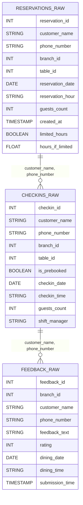

# Bronze Layer Data Model

## Business Context
The bronze layer contains raw, unprocessed data ingested directly from source systems (e.g., reservation system, check-in system, customer feedback forms). This layer serves as the immutable source of truth, capturing all events as they arrive, including late or out-of-order data. No business logic or cleaning is applied at this stage.

### Table Descriptions
- **RESERVATIONS_RAW**: Each row represents a reservation made by a customer, including who made it, for which branch and table, when, and how many guests. This is the raw feed from the reservation system.
- **CHECKINS_RAW**: Each row represents a customer check-in at a branch, whether pre-booked or walk-in, including the time, table, and shift manager. This is the raw feed from the check-in system.
- **FEEDBACK_RAW**: Each row is a customer feedback entry, including the branch, customer, feedback text, rating, and when the feedback was submitted. This is the raw feed from feedback forms or digital surveys.

