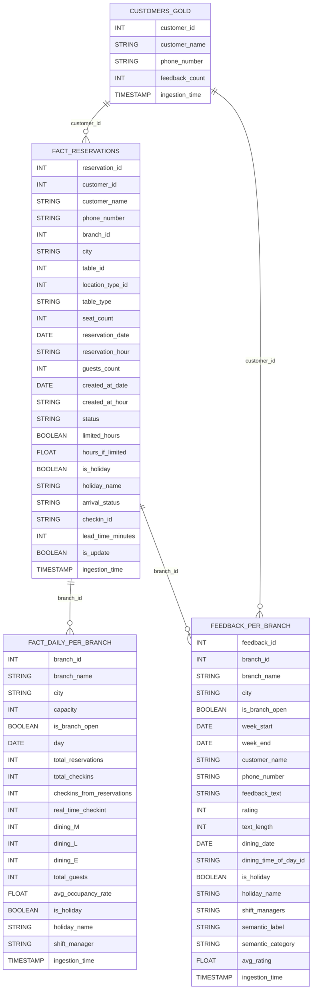

# Gold Layer Data Model

## Business Context
The gold layer contains curated, analytics-ready data for business intelligence and reporting. Data in this layer is highly structured, aggregated, and optimized for consumption by analysts and dashboards. Fact tables capture business events, while dimension tables provide descriptive context. SCD2 logic ensures historical accuracy for slowly changing attributes.

### Table Descriptions
- **FACT_RESERVATIONS**: Each row represents a reservation event, enriched with customer, branch, and table details, as well as status and arrival information. Used for reservation analytics and operational KPIs.
- **FACT_DAILY_PER_BRANCH**: Aggregated daily metrics per branch, including total reservations, check-ins, occupancy rates, and holiday/shift info. Used for branch performance monitoring.
- **FEEDBACK_PER_BRANCH**: Aggregated customer feedback per branch and week, including ratings, text analytics, and semantic labels. Used for customer satisfaction and service quality analysis.
- **CUSTOMERS_GOLD**: Customer dimension table with feedback counts and unique identifiers, used for customer segmentation and loyalty analytics.

