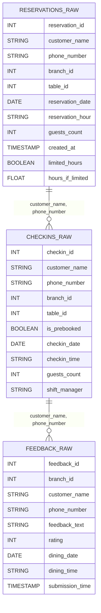

# Bronze Layer Data Model

```mermaid
erDiagram
    RESERVATIONS_RAW {
        INT reservation_id
        STRING customer_name
        STRING phone_number
        INT branch_id
        INT table_id
        DATE reservation_date
        STRING reservation_hour
        INT guests_count
        TIMESTAMP created_at
        BOOLEAN limited_hours
        FLOAT hours_if_limited
    }
    CHECKINS_RAW {
        INT checkin_id
        STRING customer_name
        STRING phone_number
        INT branch_id
        INT table_id
        BOOLEAN is_prebooked
        DATE checkin_date
        STRING checkin_time
        INT guests_count
        STRING shift_manager
    }
    FEEDBACK_RAW {
        INT feedback_id
        INT branch_id
        STRING customer_name
        STRING phone_number
        STRING feedback_text
        INT rating
        DATE dining_date
        STRING dining_time
        TIMESTAMP submission_time
    }
    RESERVATIONS_RAW ||--o{ CHECKINS_RAW : "customer_name, phone_number"
    CHECKINS_RAW ||--o{ FEEDBACK_RAW : "customer_name, phone_number"
``` 