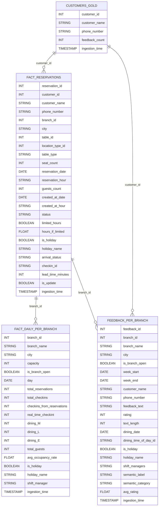

# Gold Layer Data Model

```mermaid
erDiagram
    FACT_RESERVATIONS {
        INT reservation_id
        INT customer_id
        STRING customer_name
        STRING phone_number
        INT branch_id
        STRING city
        INT table_id
        INT location_type_id
        STRING table_type
        INT seat_count
        DATE reservation_date
        STRING reservation_hour
        INT guests_count
        DATE created_at_date
        STRING created_at_hour
        STRING status
        BOOLEAN limited_hours
        FLOAT hours_if_limited
        BOOLEAN is_holiday
        STRING holiday_name
        STRING arrival_status
        STRING checkin_id
        INT lead_time_minutes
        BOOLEAN is_update
        TIMESTAMP ingestion_time
    }
    FACT_DAILY_PER_BRANCH {
        INT branch_id
        STRING branch_name
        STRING city
        INT capacity
        BOOLEAN is_branch_open
        DATE day
        INT total_reservations
        INT total_checkins
        INT checkins_from_reservations
        INT real_time_checkint
        INT dining_M
        INT dining_L
        INT dining_E
        INT total_guests
        FLOAT avg_occupancy_rate
        BOOLEAN is_holiday
        STRING holiday_name
        STRING shift_manager
        TIMESTAMP ingestion_time
    }
    FEEDBACK_PER_BRANCH {
        INT feedback_id
        INT branch_id
        STRING branch_name
        STRING city
        BOOLEAN is_branch_open
        DATE week_start
        DATE week_end
        STRING customer_name
        STRING phone_number
        STRING feedback_text
        INT rating
        INT text_length
        DATE dining_date
        STRING dining_time_of_day_id
        BOOLEAN is_holiday
        STRING holiday_name
        STRING shift_managers
        STRING semantic_label
        STRING semantic_category
        FLOAT avg_rating
        TIMESTAMP ingestion_time
    }
    CUSTOMERS_GOLD {
        INT customer_id
        STRING customer_name
        STRING phone_number
        INT feedback_count
        TIMESTAMP ingestion_time
    }
    FACT_RESERVATIONS ||--o{ FACT_DAILY_PER_BRANCH : "branch_id"
    FACT_RESERVATIONS ||--o{ FEEDBACK_PER_BRANCH : "branch_id"
    CUSTOMERS_GOLD ||--o{ FACT_RESERVATIONS : "customer_id"
    CUSTOMERS_GOLD ||--o{ FEEDBACK_PER_BRANCH : "customer_id"
``` 