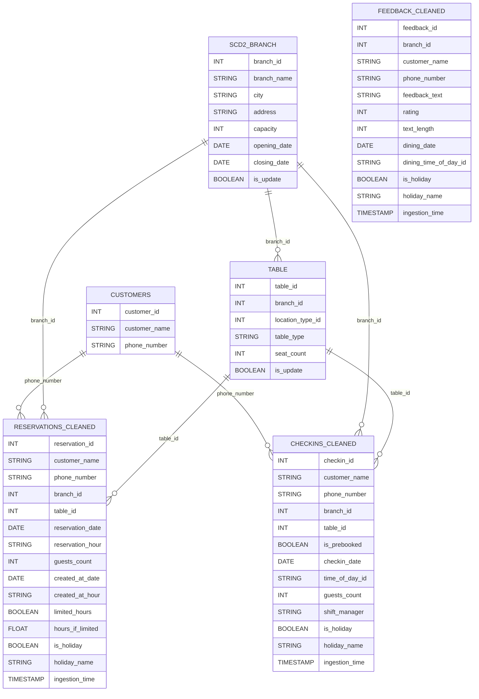

# Silver Layer Data Model

```mermaid
erDiagram
    CUSTOMERS {
        INT customer_id
        STRING customer_name
        STRING phone_number
    }
    SCD2_BRANCH {
        INT branch_id
        STRING branch_name
        STRING city
        STRING address
        INT capacity
        DATE opening_date
        DATE closing_date
        BOOLEAN is_update
    }
    TABLE {
        INT table_id
        INT branch_id
        INT location_type_id
        STRING table_type
        INT seat_count
        BOOLEAN is_update
    }
    CHECKINS_CLEANED {
        INT checkin_id
        STRING customer_name
        STRING phone_number
        INT branch_id
        INT table_id
        BOOLEAN is_prebooked
        DATE checkin_date
        STRING time_of_day_id
        INT guests_count
        STRING shift_manager
        BOOLEAN is_holiday
        STRING holiday_name
        TIMESTAMP ingestion_time
    }
    RESERVATIONS_CLEANED {
        INT reservation_id
        STRING customer_name
        STRING phone_number
        INT branch_id
        INT table_id
        DATE reservation_date
        STRING reservation_hour
        INT guests_count
        DATE created_at_date
        STRING created_at_hour
        BOOLEAN limited_hours
        FLOAT hours_if_limited
        BOOLEAN is_holiday
        STRING holiday_name
        TIMESTAMP ingestion_time
    }
    FEEDBACK_CLEANED {
        INT feedback_id
        INT branch_id
        STRING customer_name
        STRING phone_number
        STRING feedback_text
        INT rating
        INT text_length
        DATE dining_date
        STRING dining_time_of_day_id
        BOOLEAN is_holiday
        STRING holiday_name
        TIMESTAMP ingestion_time
    }
    CUSTOMERS ||--o{ RESERVATIONS_CLEANED : "phone_number"
    CUSTOMERS ||--o{ CHECKINS_CLEANED : "phone_number"
    SCD2_BRANCH ||--o{ TABLE : "branch_id"
    SCD2_BRANCH ||--o{ CHECKINS_CLEANED : "branch_id"
    SCD2_BRANCH ||--o{ RESERVATIONS_CLEANED : "branch_id"
    TABLE ||--o{ RESERVATIONS_CLEANED : "table_id"
    TABLE ||--o{ CHECKINS_CLEANED : "table_id"
``` 